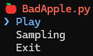
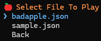
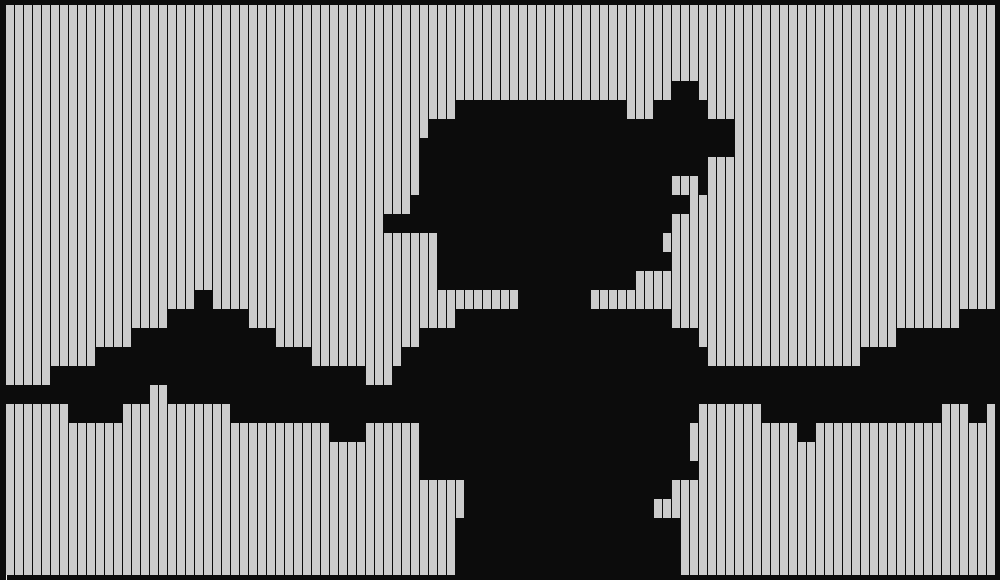

# BadApple.py
This repository is a project that plays [BadApple](https://youtu.be/FtutLA63Cp8?si=pT6fLQlldiAhg68t) in the terminal.
## Run BadApple.py
1. Clone the repository
```bash
git clone https://github.com/DevNyanHa/BadApple.py.git
cd BadApple.py
```
2. Install dependencies
```bash
pip install -r requirements.txt
```
3. Run the BadApple.py
```bash
python __main__.py
```
| Step-1 | Step-2 | Step-3 |
| :---: | :---: | :---: |
| Select Play<br> | Select File<br> | Enjoy!<br> |
## Video Sampling
To play the video, you first need to convert it into json.

...
